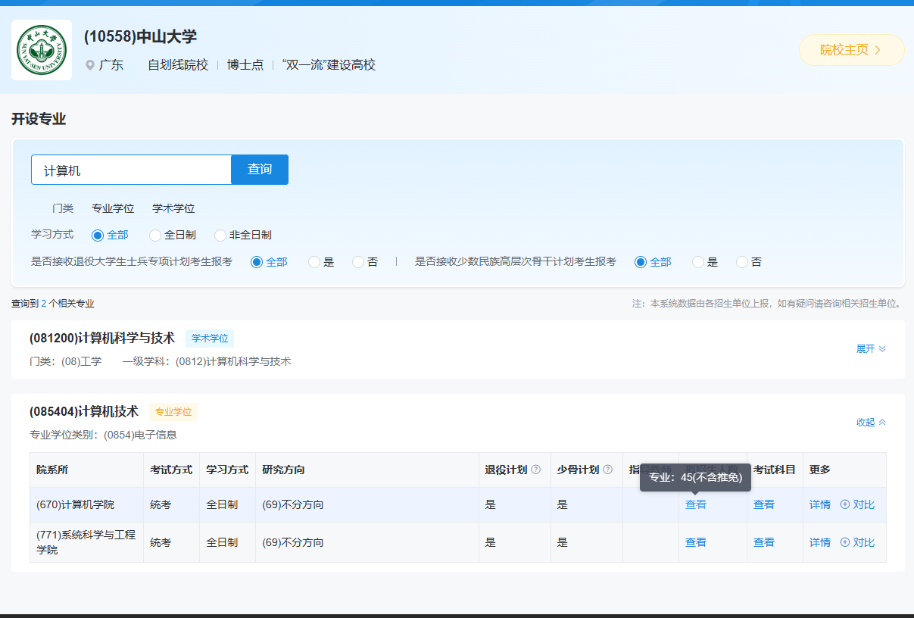
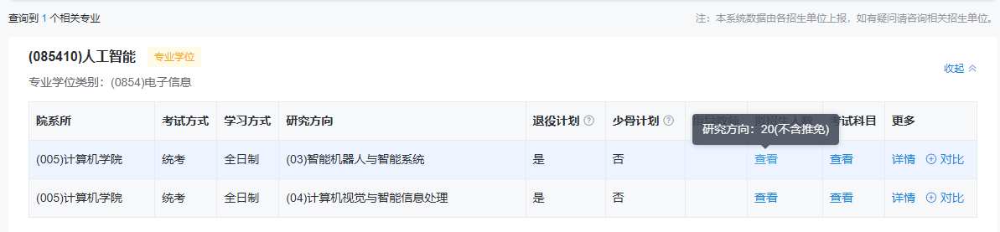
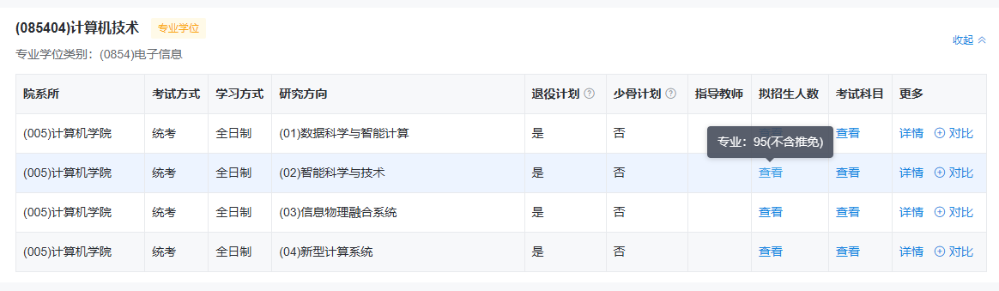
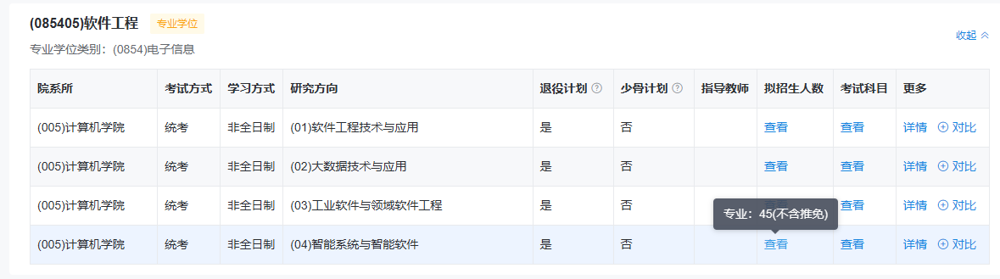

中山大学
(085404)计算机技术
专业学位类别：(0854)电子信息
全日制 计算机学院 招人45 
https://yz.chsi.com.cn/zsml/dwzy.do?dwdm=10558&dwmc=%E4%B8%AD%E5%B1%B1%E5%A4%A7%E5%AD%A6&ssmc=%E5%B9%BF%E4%B8%9C&schId=368411&xxfs=&mldm=&dwlxs%5B0%5D=zhx&dwlxs%5B1%5D=syl&dwlxs%5B2%5D=bs&tydxs=&jsggjh=&sign=a972b9b1ff4f048e8c02295cba0ff864

招人够多。实力够就冲这个，有非全日制。但非全都很多人报，应该不好调剂。

---

华南理工大学
只招10个人，希望渺茫
https://yz.chsi.com.cn/zsml/dwzy.do?dwdm=10561&dwmc=%E5%8D%8E%E5%8D%97%E7%90%86%E5%B7%A5%E5%A4%A7%E5%AD%A6&ssmc=%E5%B9%BF%E4%B8%9C&schId=368416&xxfs=&mldm=&dwlxs%5B0%5D=zhx&dwlxs%5B1%5D=syl&dwlxs%5B2%5D=bs&tydxs=&jsggjh=&sign=896e08e29bff35ab779b50f06218c1b7

---
广东工业大学

招20个人 智能机器人与智能系统 计算机学院
https://yz.chsi.com.cn/zsml/dwzy.do?dwdm=11845&dwmc=%E5%B9%BF%E4%B8%9C%E5%B7%A5%E4%B8%9A%E5%A4%A7%E5%AD%A6&ssmc=%E5%B9%BF%E4%B8%9C&schId=368400&xxfs=&mldm=&dwlxs%5B0%5D=bs&tydxs=&jsggjh=&sign=f7e80131abfcba80ecf9aaaf18f76822

招95个人 计算机学院 (03)信息物理融合系统
https://yz.chsi.com.cn/zsml/dwzy.do?dwdm=11845&dwmc=%E5%B9%BF%E4%B8%9C%E5%B7%A5%E4%B8%9A%E5%A4%A7%E5%AD%A6&ssmc=%E5%B9%BF%E4%B8%9C&schId=368400&xxfs=&mldm=&dwlxs%5B0%5D=bs&tydxs=&jsggjh=&sign=f7e80131abfcba80ecf9aaaf18f76822

有非全好调剂
https://yz.chsi.com.cn/zsml/dwzy.do?dwdm=11845&dwmc=%E5%B9%BF%E4%B8%9C%E5%B7%A5%E4%B8%9A%E5%A4%A7%E5%AD%A6&ssmc=%E5%B9%BF%E4%B8%9C&schId=368400&xxfs=&mldm=&dwlxs%5B0%5D=bs&tydxs=&jsggjh=&sign=f7e80131abfcba80ecf9aaaf18f76822

年纪大了，软件可以在家里学，开源的项目还更牛逼。但是硬件的话，要去有机器人和实验室的大学才行。我动手能力挺强的，AI机器人一定是未来。